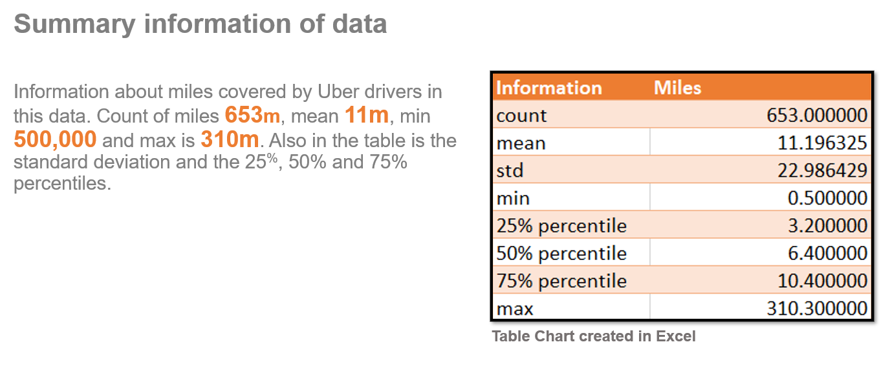
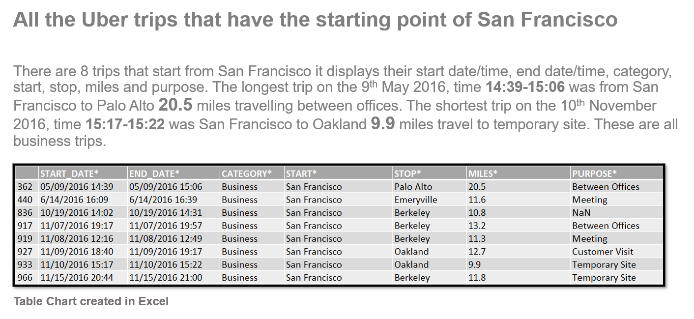
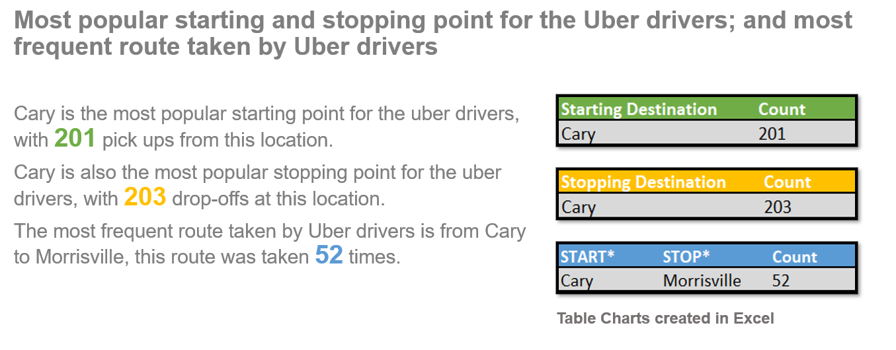
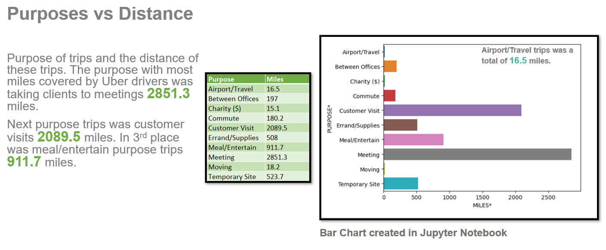
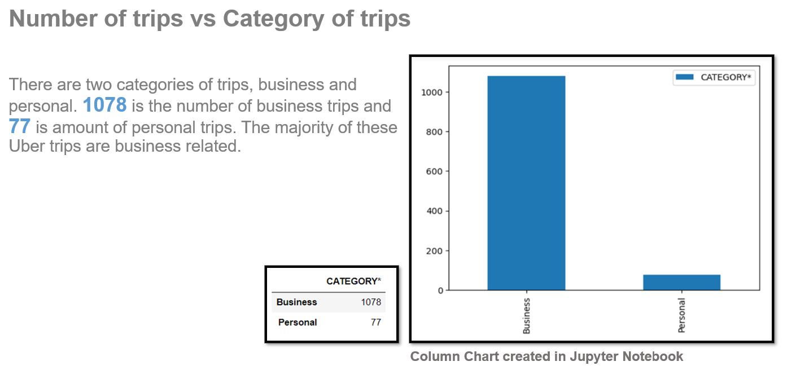
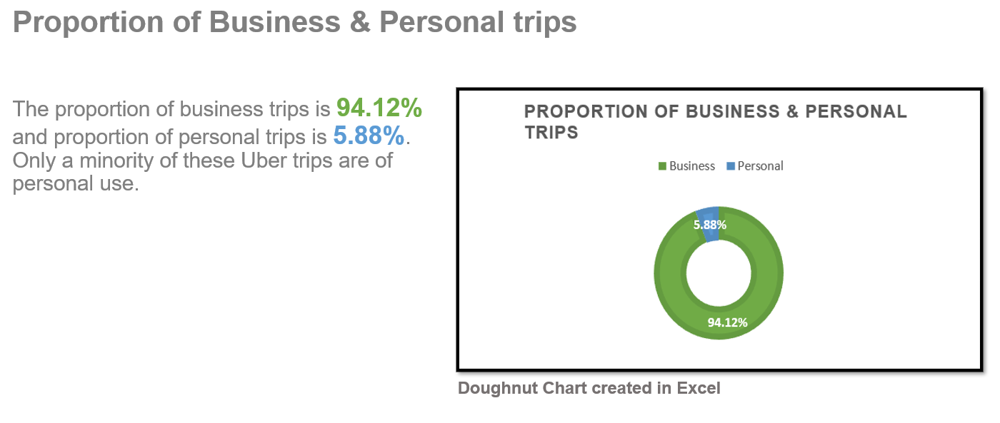

# UberDrives
### Uber booking data: client type, routes, miles and purpose of these journeys. Using Python to analyze. Also using Python and Excel for visualizations. 
 

This report is based on, uber drives. The routes from starting point to ending point, miles covered, type of client and the purpose of their journey. 
### I will analyze: 
<li>Summary information of data. (Table Chart)
<li>All the Uber trips that have the starting point of San Francisco. (Table Chart)
<li>Most popular starting and stopping point for the Uber drivers; and most frequent route taken by Uber drivers. (Table Charts)
<li>Purposes vs Distance. (Bar Chart)
<li>Number of trips vs Category of trips. (Column Chart)
<li>Proportion of Business & Personal trips. (Doughnut Chart)

### Software used: 
Jupyter Notebook: To analyze and visualize the data findings. Libraries used NumPy, Pandas, Matplotlib and Seaborn.  
Microsoft Excel: To visualize the data findings.         
  
 

 

  
 
  
 

  

 

