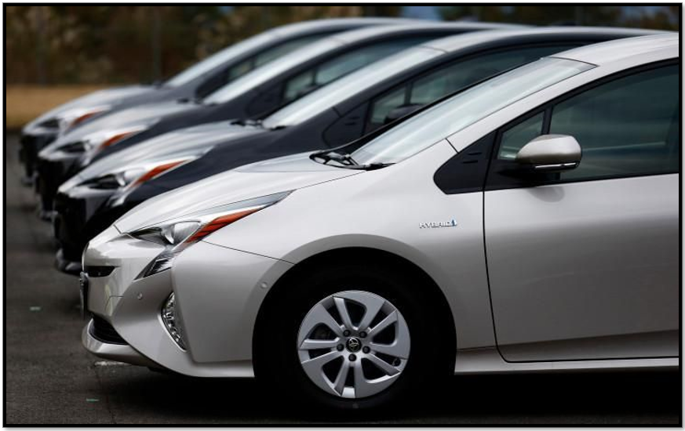

# UberDrives
### Uber booking data: client type, routes, miles and purpose of these journeys. Using Python to analyze. Also using Python and Excel for visualizations. 
 

This report is based on, uber drives. The routes from starting point to ending point, miles covered, type of client and the purpose of their journey. 
### I will analyze: 
<li>Summary information of data. (Table Chart)
<li>All the Uber trips that have the starting point of San Francisco. (Table Chart)
<li>Most popular starting and stopping point for the Uber drivers; and most frequent route taken by Uber drivers. (Table Charts)
<li>Purposes vs Distance. (Bar Chart)
<li>Number of trips vs Category of trips. (Column Chart)
<li>Proportion of Business & Personal trips. (Doughnut Chart)

### Software used: 
Jupyter Notebook: To analyze and visualize the data findings. Libraries used NumPy, Pandas, Matplotlib and Seaborn.  
Microsoft Excel: To visualize the data findings.         
  
 

 

  
 
  
 

  

 

## Summary
  
### In this report I analysed:  

<li> Summary information of data. 
<li> All the Uber trips that have the starting point of San Francisco.
<li> Most popular starting and stopping point for the Uber drivers and most frequent route taken by Uber drivers. 
<li> Purposes vs Distance.
<li> Number of trips vs Category of trips. 
<li> Proportion of Business & Personal trips. 
  
### Cary was the most popular start 201 times and stop 203 times point for these Uber drivers. Most frequent route taken by Uber drivers was from Cary to Morrisville 52 times.  All start trips from San Francisco were business related. 
### Purpose trips of meetings, customer visits and meal/entertain being the most miles covered. These being the most trips makes sense. The reasons depending on location, if it’s business related there could be meetings at other external offices. Customer visits if you’re for e.g. an independent business owner and are going to visit a customer to work on a project in their location. Meal/entertain trips which is popular among most age groups using Uber for this reason. The proportion of business trips is 94.12% the majority of trips was business related. Minority of these Uber trips were of personal use at 5.88%.
